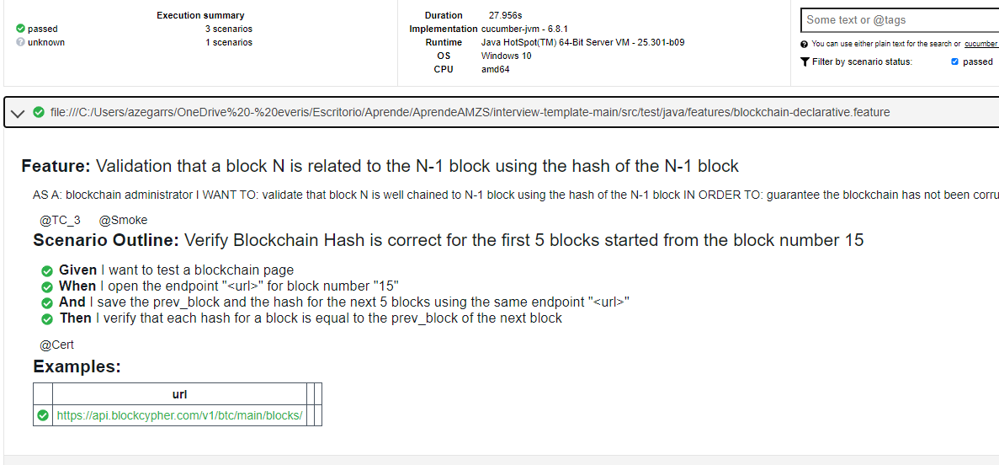

<h1>Selenium3Java Framework</h1>

This framework has been developed to demostrate the use of selenium 3.7 with java maven junit and cucumber

# System requirements:
- Windows 7+
- Java JDK 1.8
- Maven 3.6.3

Environment Variables Configured to work with Java and Maven

# Configurations:
<h4> Update cucumber.properties located in test/java/resources </h4>
These properties are needed in order to run tests:

* webdriver.driver.path=  folder location of the chromedriver.exe
* webdriver.driver.version= name of the chromedriver. You may need to change according your chrome version
* webdriver.browser= browser to run tests. Current support: Chrome
* webdriver.browser.dimension.width=  Width dimension for browser
* webdriver.browser.dimension.height= Height dimension for browser
* webdriver.wait.implicit= Implicit wait time for webdriver

# Commands for execution:
* Run the following command using a Terminal: 

```bash
mvn clean test -Dcucumber.options="--tags (@TC_3 and @Cert)"
```
* The tests can be executed/debugged using testRunner located in test/java/runner

# Test Results
* maven-surefire-plugin will generate the report files: runner.testRunner.txt and TEST-runner.testRUnner.xml when executed using mvn commands. 
```xml 
<?xml version="1.0" encoding="UTF-8"?>
<testsuite>
  <testcase name="I open the endpoint &quot;https://api.blockcypher.com/v1/btc/main/blocks/&quot; for block number &quot;15&quot;" classname="Verify Blockchain Hash is correct for the first 5 blocks started from the block number 15" time="1.965">
    <system-out><![CDATA[&amp#27;[32m.&amp#27;[0m]]></system-out>
  </testcase>
  <testcase name="I save the prev_block and the hash for the next 5 blocks using the same endpoint &quot;https://api.blockcypher.com/v1/btc/main/blocks/&quot;" classname="Verify Blockchain Hash is correct for the first 5 blocks started from the block number 15" time="1.759">
    <system-out><![CDATA[&amp#27;[32m.&amp#27;[0m]]></system-out>
  </testcase>
</testsuite>
```
* testRunner.java is also configured to generate report: cucumber-reports.html in <strong>target</strong> folder. Open with a browser:

 
# Feature Layer:
* Use Cases and Scenarios are located in this layer.
* .feature files are located in path: test/java/features

<h5> Scenario Outline Example </h5>

```gherkin
Scenario Outline: Verify Blockchain Hash is correct for the first 5 blocks started from the block number 15
Given I want to test a blockchain page
When I open the endpoint "<url>" for block number "15"
And I save the prev_block and the hash for the next 5 blocks using the same endpoint "<url>"
Then I verify that each hash for a block is equal to the prev_block of the next block
```

# StepDefinition Layer:
* .feature files are interpreted into java language in this layer.
* stepDefinition is located in path: test/java/glue with the name BlockChainStepDefinition.

<h5> StepDefinition Example </h5>

```gherkin
  @Given("I want to test a blockchain page")
  public void i_want_to_test_a_blockchain_page() {
   blockChain = new BlockChainPages(seleniumDriver.getDriver());
  }
```

# Step Layer:
* Java files that define the behavior and elements from a page.
* Step Java files are located in path: test/java/pages. Example BlockChainPages.java

<h5> Step Example </h5> 
   
```
  public String getValueFromJson(String key){
        String jsonString =  driver.findElement(jsonStringLocator).getText();
        JSONObject obj = new JSONObject(jsonString);
        return  obj.getString(key);
    }
```

# DataEntities Layer:
* Java files that represent an entity that can be identified from the webpage.
* Files are located in path: main/java/com/aprende/web/dataEntities. Example BlockEntity.java

```
  public BlockEntity(String prev_block, String hash) {
        this.prev_block=prev_block;
        this.hash=hash;
    }
```

# Lib Layer:
* Java files that provide additional functionality to the framework.
* Files are located in path: main/java/com/aprende/web/lib. 
* Example WebDriverManager.java for WebDriver configuration and PropertiesVault.java for loading properties.


```
 public static String getProp(String key)   {

        try {
            prop = new  Properties();
            inputStreamProp =   new FileInputStream("src/test/java/resources/cucumber.properties");
            prop.load(inputStreamProp);
        }catch (Exception e){
            e.printStackTrace();
        }finally {
            try {
                inputStreamProp.close();
            } catch (IOException e) {
                e.printStackTrace();
            }
        }
        return prop.getProperty(key);

    }
```
 
