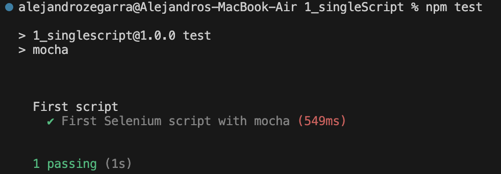

<h1>Selenium4 JS Framework</h1>

This framework has been developed to demostrate the use of selenium 4 with javascript and node in MacOS

# System requirements:
- node: v18
- npm: v10


# Configurations:
<h4>1_singleScript</h4>

* libraries:
  * selenium-webdriver v4 
  * mocha v10:  testing framework 
* location: Mocha looks for test files in a directory named test (test/*.spec.js or test/*.test.js)

* TBD

# Commands for execution:
<h4>1_singleScript</h4>

* Run the following command using a Terminal: 

```bash
    npm install
    npx mocha selenium.spec.js  
    npm test
```
* The tests can be executed/debugged using: 

# Test Results 
<h4>1_singleScript</h4>

* Results displayed in the console: